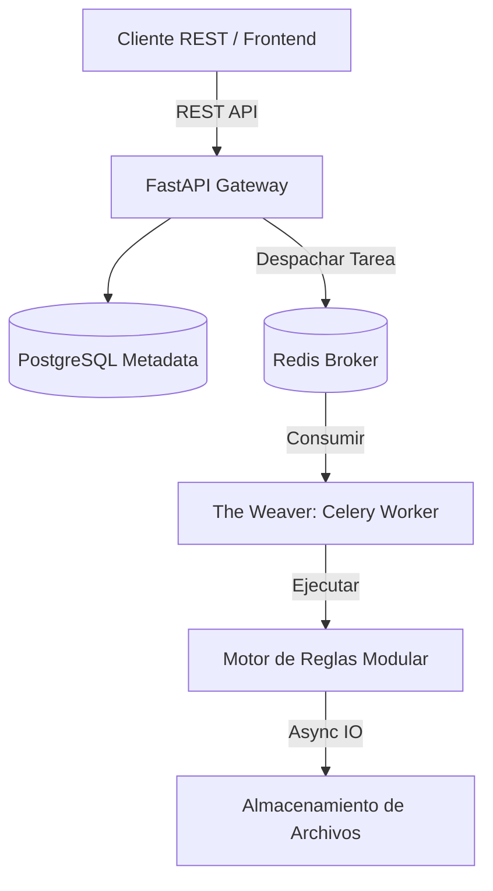

# DataWeaver 🚀

> **Un Motor de Automatización Declarativa de Excel Liviano para la Empresa Moderna**

Transforma flujos de trabajo fragmentados en Excel en activos estructurados, versionables y escalables. DataWeaver reemplaza macros VBA frágiles con un Motor de Reglas paramétricas de alta densidad construido sobre FastAPI, Pandas y Celery.

[](https://fastapi.tiangolo.com)
[](https://www.python.org)
[](https://www.postgresql.org)
[](https://docs.celeryq.dev)

[English](README.md) | **Español**

---

## 💎 La Ventaja Lean

Los proyectos de automatización estándar suelen sufrir de "Complejidad Excesiva". DataWeaver está construido sobre **Principios de Densidad**:

- **Super-Skills**: En lugar de 50 herramientas distintas, utilizamos reglas paramétricas (ej. `aggregate` gestiona suma, promedio, conteo, máx, mín).
- **Super-Params**: Parámetros globales como `target_sheet` permiten que cualquier transformación materialice resultados directamente en hojas nombras.
- **Arquitectura Lean**: Motor de reglas modular compatible con SOLID y capa API consolidada para máxima velocidad de desarrollo.

---

## 🏗️ Arquitectura

### Diseño del Sistema



### Estructura Limpia

| Capa | Ruta | Responsabilidad |
|-----------|-----------|---------|
| **Core** | `app/core/` | Auth, BD, Modelos y Esqueletos Pydantic |
| **Motor de Reglas** | `app/engine/rules/` | Reglas Modulares (`filter`, `aggregate`, `move`) y Factory |
| **Orquestador** | `app/engine/engine.py` | Gestión de Contexto y Ejecución de Pasos |
| **Gateway** | `app/api/` | Endpoints REST Asíncronos No Bloqueantes |
| **Workers** | `app/tasks/` | Tareas Celery Asíncronas con Reintentos Tolerantes a Fallos |
| **Migraciones** | `alembic/` | Migraciones de Esquema de Base de Datos (Alembic) |

---

## 🚀 Inicio Rápido

### Ejecutar con Docker (Recomendado)

```bash
git clone https://github.com/Medalcode/DataWeaver.git
cd DataWeaver
cp .env.example .env
docker-compose up -d
```

Los servicios incluyen verificaciones de salud, migraciones automáticas y un volumen de almacenamiento compartido entre la API y los workers Celery.

### Desarrollo Local

```bash
# 1. Instalar Dependencias
pip install -r requirements.txt
cp .env.example .env

# 2. Iniciar Infraestructura
docker-compose up -d postgres redis

# 3. Ejecutar Migraciones
alembic upgrade head

# 4. Iniciar Servicios
uvicorn app.main:app --reload
celery -A app.tasks.celery_app worker --loglevel=info
celery -A app.tasks.celery_app beat --loglevel=info
```

---

## 📖 Motor de Reglas Paramétricas

DataWeaver utiliza **Pasos Declarativos**. Cualquier paso puede materializar su resultado agregando el parámetro `target_sheet`.

### 1. `filter` (Transformación)
Filtra el conjunto de datos activo.
- **Parámetros**: `column`, `operator`, `value` (`=`, `!=`, `>`, `<`, `>=`, `<=`, `contains`)
- **Materialización**: `target_sheet` (Opcional)

### 2. `aggregate` (Super-Skill)
Resumen e inteligencia de datos.
- **Parámetros**: `group_by`, `field`, `op` (`sum`, `mean`, `count`, `max`, `min`)
- **Requerido**: `target_sheet`

### 3. `move` (Legacy)
Materialización directa del conjunto de datos activo.

---

## 🧪 Pruebas y Garantía de Calidad

Mantenemos una suite de pruebas automatizadas con 100% de éxito (24 tests que cubren Motor, Auth, API, Tareas y Validación).

```bash
# Configurar PYTHONPATH y ejecutar la suite de pruebas
$env:PYTHONPATH = "backend"
python -m pytest tests/ -v
```

CI ejecuta automáticamente pytest en Python 3.10, 3.11, 3.12 y verifica la reproducibilidad de la imagen Docker en cada push.

---

**Construido con ❤️ para la automatización escalable de Excel.**
