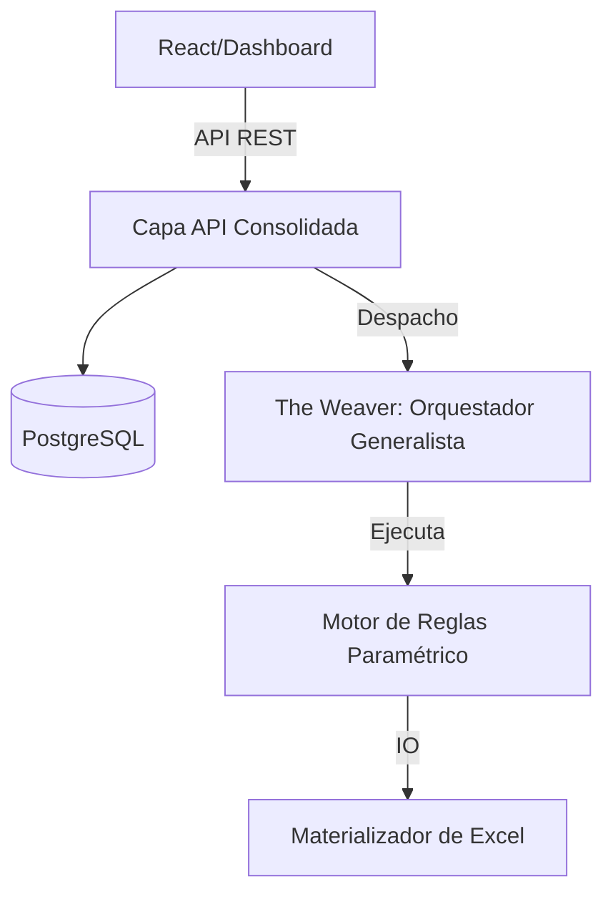

# DataWeaver 🚀

> **Motor de Automatización de Excel Declarativo y "Lean" para Negocios Modernos**

Transforma flujos de trabajo de Excel fragmentados en activos estructurados, versionables y escalables. DataWeaver reemplaza las frágiles macros VBA con un motor de reglas de alta densidad basado en FastAPI y Pandas.

[](https://fastapi.tiangolo.com)
[](https://www.python.org)
[](https://www.postgresql.org)
[](https://docs.celeryq.dev)

[English](README.md) | **Español**

---

## 💎 La Ventaja "Lean"

Los proyectos de automatización estándar suelen sufrir de "Hinchazón por Complejidad". DataWeaver se construye bajo **Principios de Densidad**:

- **Super-Skills**: En lugar de 50 herramientas diferentes, usamos reglas paramétricas (ej. `aggregate` maneja suma, promedio, conteo).
- **Super-Params**: Parámetros globales como `target_sheet` permiten que cualquier transformación materialice resultados directamente.
- **Arquitectura Limpia**: Capas de API y Lógica consolidadas para máxima velocidad de desarrollo y mínimo mantenimiento.

---

## 🏗️ Arquitectura

### Diseño de Sistema de Alta Densidad



### Estructura Limpia

| Capa | Ruta | Responsabilidad |
|-----------|-----------|---------|
| **Core** | `app/core/` | Auth, DB, Modelos y Esquemas (La Columna Vertebral) |
| **Lógica** | `app/engine/logic.py` | Reglas Consolidadas y Super-Skills |
| **Orquestador** | `app/engine/engine.py` | Gestión de Contexto y Ejecución de Pasos |
| **Puerta de Enlace** | `app/api/` | Endpoints REST Modulares |

---

## 🚀 Inicio Rápido

### Ejecutar con Docker (Recomendado)

```bash
git clone https://github.com/Medalcode/DataWeaver.git
cd DataWeaver
docker-compose up -d
```

### Desarrollo Local

```bash
# 1. Instalación
pip install -r requirements.txt
cp .env.example .env

# 2. Iniciar Infraestructura
docker-compose up -d postgres redis

# 3. Iniciar Motores
uvicorn app.main:app --reload
celery -A app.tasks.celery_app worker --loglevel=info
celery -A app.tasks.celery_app beat --loglevel=info
```

---

## 📖 Motor de Reglas Paramétrico

DataWeaver usa **Pasos Declarativos**. Cada paso puede materializar su resultado simplemente añadiendo el parámetro `target_sheet`.

### 1. `filter` (Transformación)
Filtra el dataset de trabajo actual.
- **Params**: `column`, `operator`, `value`
- **Materialización**: `target_sheet` (Opcional)

### 2. `aggregate` (Super-Skill)
Resumen de datos potente.
- **Params**: `group_by`, `field`, `op` (`sum`, `mean`, `count`, `max`, `min`)
- **Requerido**: `target_sheet`

### 3. `move` (Legacy)
Contenedor de materialización simple para el dataset actual.

---

## 🧪 Pruebas

Creemos en la automatización a prueba de balas.

```bash
# Configurar ruta y ejecutar suite
$env:PYTHONPATH = "backend"
pytest -v
```

---

## 🤝 Contribuir

Priorizamos la **Densidad sobre la Fragmentación**. Antes de crear un archivo nuevo, pregunta: *"¿Puede esto ser un parámetro en una skill existente?"*

1. Haz fork del repo.
2. Construye tu funcionalidad en `logic.py`.
3. Documéntala en `skills.md`.
4. Envía tu PR.

---

**Construido con ❤️ para quienes quieren automatizar sin el equipaje del pasado.**
