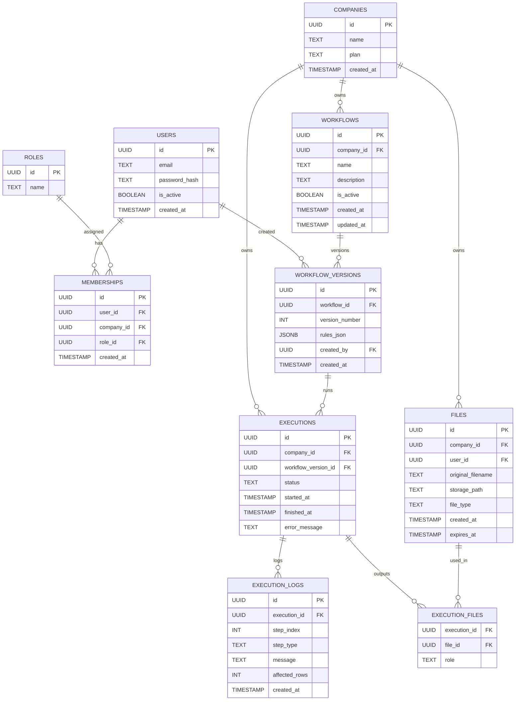

# DataWeaver

DataWeaver is a SaaS-style **Macro Builder** that lets non-technical users automate Excel workflows without VBA. Users define rules in a visual UI; the platform executes those rules and delivers processed Excel outputs with full auditability.

## Why It Exists
- Excel automation depends on a single person who “knows macros”.
- Workflows are fragile, undocumented, and hard to change.
- Small changes require reprogramming and create operational risk.

DataWeaver converts **business rules** into **reproducible automations**.

## Core Idea
Separate the system into three layers:

1. **Rules (what to do)** — defined by users in the UI
2. **Engine (how to do it)** — internal logic that executes steps
3. **Executor** — runs the engine and produces Excel outputs

This separation makes the system scalable, testable, and reusable across desktop or web.

## MVP Feature Set
- Upload `.xlsx`
- Visual Rule Builder (no code)
- Rule validation + inline errors
- Preview (before/after sample rows)
- Execute workflow (async)
- Download output
- Save workflows with versioning
- Execution logs and audit trail

## Rule Types (MVP)
- **Row rules**: equals, not equals, greater/less than, empty
- **Actions**: move row, copy row, delete row, color/mark
- **Transformations**: group by, sum/count/avg
- **Output**: new sheet, summary sheet

## Rule Engine (Concept)
The engine takes a DataFrame and a JSON workflow, and returns outputs + logs.

Example:

```json
{
  "steps": [
    {
      "type": "filter",
      "column": "Estado",
      "operator": "=",
      "value": "RECHAZADO"
    },
    {
      "type": "move",
      "target_sheet": "Errores"
    },
    {
      "type": "group_sum",
      "group_by": "Mes",
      "field": "Monto",
      "target_sheet": "Resumen"
    }
  ]
}
```

## Architecture (Target)

```text
React UI
  ↓
FastAPI
  ↓
Rule Engine (Python + pandas)
  ↓
Celery Worker (async jobs)
  ↓
Excel Output
```

## API Surface (MVP)
- `POST /auth/login`
- `POST /files/upload`
- `GET /files/{id}/download`
- `POST /workflows`
- `GET /workflows`
- `POST /workflows/{id}/versions`
- `POST /preview`
- `POST /executions`
- `GET /executions/{id}`
- `GET /executions/{id}/logs`
- `GET /executions/{id}/output`

## Data Model (Multi‑Tenant)
Key entities:
- `companies` (tenants)
- `users`
- `memberships` (user ↔ company with role)
- `workflows` + `workflow_versions`
- `executions` + `execution_logs`
- `files`

All core tables include `company_id` to enforce isolation.

### ERD (Mermaid)


## Roles (MVP)
- **Owner**: everything + billing
- **Admin**: manage users + workflows
- **Editor**: create/edit workflows
- **Runner**: execute workflows
- **Viewer**: read‑only + logs

## Security Principles
- Tenant isolation by `company_id`
- JWT with `company_id` and role
- Short‑lived file storage with expiration
- No VBA or macros executed

## Roadmap
**v1**
- Filters, moves, group sums
- Workflow versioning
- Async executions

**v2**
- Multi‑file workflows
- Scheduling
- Roles + permissions UI

**v3**
- ERP integrations
- Public API
- Enterprise audit exports

## Rule JSON Schema (MVP)
Use this for server‑side validation of workflows before execution.

```json
{
  "$schema": "http://json-schema.org/draft-07/schema#",
  "title": "WorkflowRules",
  "type": "object",
  "required": ["steps"],
  "properties": {
    "steps": {
      "type": "array",
      "minItems": 1,
      "items": {
        "type": "object",
        "required": ["type"],
        "properties": {
          "type": { "type": "string", "enum": ["filter", "move", "group_sum", "format"] },
          "column": { "type": "string" },
          "operator": { "type": "string", "enum": ["=", "!=", ">", "<", ">=", "<="] },
          "value": {},
          "target_sheet": { "type": "string" },
          "group_by": { "type": "string" },
          "field": { "type": "string" },
          "format": { "type": "string" }
        },
        "allOf": [
          { "if": { "properties": { "type": { "const": "filter" } } }, "then": { "required": ["column", "operator", "value"] } },
          { "if": { "properties": { "type": { "const": "move" } } }, "then": { "required": ["target_sheet"] } },
          { "if": { "properties": { "type": { "const": "group_sum" } } }, "then": { "required": ["group_by", "field", "target_sheet"] } },
          { "if": { "properties": { "type": { "const": "format" } } }, "then": { "required": ["column", "format"] } }
        ]
      }
    }
  }
}
```

---

If you want the full schema, OpenAPI spec, and rule JSON Schema, see the product design notes in this repository.
