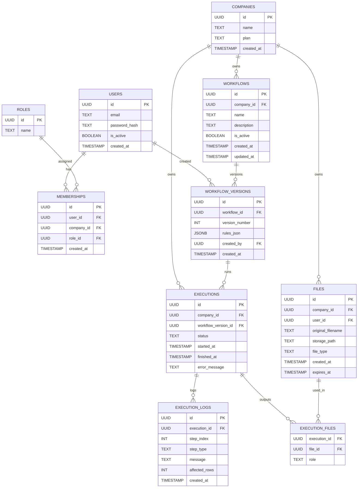

# DataWeaver

DataWeaver es un **Macro Builder** estilo SaaS que permite a usuarios no técnicos automatizar flujos de Excel sin VBA. Los usuarios definen reglas en una UI visual; la plataforma ejecuta esas reglas y entrega salidas de Excel procesadas con auditoría completa.

## Por qué existe
- La automatización en Excel depende de una sola persona que “sabe macros”.
- Los flujos son frágiles, sin documentación y difíciles de cambiar.
- Cambios pequeños requieren reprogramar y generan riesgo operativo.

DataWeaver convierte **reglas de negocio** en **automatizaciones reproducibles**.

## Idea central
Separa el sistema en tres capas:

1. **Reglas (qué hacer)** — definidas por usuarios en la UI
2. **Motor (cómo hacerlo)** — lógica interna que ejecuta pasos
3. **Ejecutor** — corre el motor y produce salidas en Excel

Esta separación hace el sistema escalable, testeable y reutilizable en desktop o web.

## Alcance MVP
- Carga de `.xlsx`
- Rule Builder visual (sin código)
- Validación de reglas + errores inline
- Preview (filas de muestra antes/después)
- Ejecutar flujo (async)
- Descargar resultado
- Guardar workflows con versionado
- Logs de ejecución y auditoría

## Tipos de reglas (MVP)
- **Reglas de fila**: igual, distinto, mayor/menor, vacío
- **Acciones**: mover fila, copiar fila, eliminar fila, marcar/color
- **Transformaciones**: agrupar por, sumar/contar/promedio
- **Salida**: nueva hoja, hoja de resumen

## Motor de reglas (concepto)
El motor recibe un DataFrame y un workflow JSON, y devuelve salidas + logs.

Ejemplo:

```json
{
  "steps": [
    {
      "type": "filter",
      "column": "Estado",
      "operator": "=",
      "value": "RECHAZADO"
    },
    {
      "type": "move",
      "target_sheet": "Errores"
    },
    {
      "type": "group_sum",
      "group_by": "Mes",
      "field": "Monto",
      "target_sheet": "Resumen"
    }
  ]
}
```

## Arquitectura (objetivo)

```text
UI React
  ↓
FastAPI
  ↓
Motor de reglas (Python + pandas)
  ↓
Celery Worker (jobs async)
  ↓
Salida Excel
```

## Superficie de API (MVP)
- `POST /auth/login`
- `POST /files/upload`
- `GET /files/{id}/download`
- `POST /workflows`
- `GET /workflows`
- `POST /workflows/{id}/versions`
- `POST /preview`
- `POST /executions`
- `GET /executions/{id}`
- `GET /executions/{id}/logs`
- `GET /executions/{id}/output`

## Modelo de datos (multi‑tenant)
Entidades clave:
- `companies` (tenants)
- `users`
- `memberships` (user ↔ company con rol)
- `workflows` + `workflow_versions`
- `executions` + `execution_logs`
- `files`

Todas las tablas core incluyen `company_id` para forzar aislamiento.

### ERD (Mermaid)


## Roles (MVP)
- **Owner**: todo + billing
- **Admin**: gestiona usuarios + workflows
- **Editor**: crea/edita workflows
- **Runner**: ejecuta workflows
- **Viewer**: solo lectura + logs

## Principios de seguridad
- Aislamiento de tenant por `company_id`
- JWT con `company_id` y rol
- Almacenamiento de archivos con expiración corta
- No se ejecuta VBA ni macros

## Roadmap
**v1**
- Filtros, movimientos, agrupaciones y sumas
- Versionado de workflows
- Ejecuciones async

**v2**
- Flujos multi‑archivo
- Programación
- UI de roles + permisos

**v3**
- Integraciones ERP
- API pública
- Exportaciones de auditoría empresariales

## JSON Schema de reglas (MVP)
Usa esto para validación en servidor antes de ejecutar.

```json
{
  "$schema": "http://json-schema.org/draft-07/schema#",
  "title": "WorkflowRules",
  "type": "object",
  "required": ["steps"],
  "properties": {
    "steps": {
      "type": "array",
      "minItems": 1,
      "items": {
        "type": "object",
        "required": ["type"],
        "properties": {
          "type": { "type": "string", "enum": ["filter", "move", "group_sum", "format"] },
          "column": { "type": "string" },
          "operator": { "type": "string", "enum": ["=", "!=", ">", "<", ">=", "<="] },
          "value": {},
          "target_sheet": { "type": "string" },
          "group_by": { "type": "string" },
          "field": { "type": "string" },
          "format": { "type": "string" }
        },
        "allOf": [
          { "if": { "properties": { "type": { "const": "filter" } } }, "then": { "required": ["column", "operator", "value"] } },
          { "if": { "properties": { "type": { "const": "move" } } }, "then": { "required": ["target_sheet"] } },
          { "if": { "properties": { "type": { "const": "group_sum" } } }, "then": { "required": ["group_by", "field", "target_sheet"] } },
          { "if": { "properties": { "type": { "const": "format" } } }, "then": { "required": ["column", "format"] } }
        ]
      }
    }
  }
}
```

---

Si quieres el esquema completo, la especificación OpenAPI y otros artefactos, revisa las notas de diseño del producto en este repositorio.
