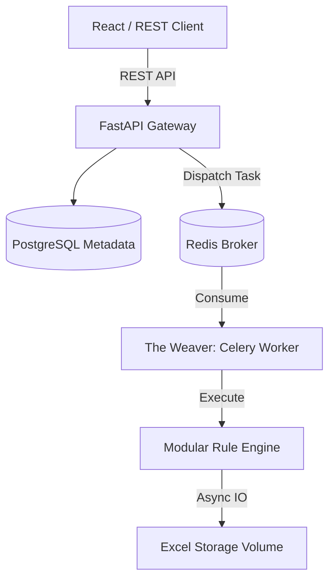

# DataWeaver 🚀

> **A Lean, Declarative Excel Automation Engine for Modern Business**

Transform fragmented Excel workflows into structured, versionable, and scalable assets. DataWeaver replaces fragile VBA macros with a high-density, parametric Rule Engine built on FastAPI, Pandas, and Celery.

[](https://fastapi.tiangolo.com)
[](https://www.python.org)
[](https://www.postgresql.org)
[](https://docs.celeryq.dev)

**English** | [Español](README.es.md)

---

## 💎 The Lean Advantage

Standard automation projects often suffer from "Complexity Bloat". DataWeaver is built on **Density Principles**:

- **Super-Skills**: Instead of 50 different tools, we use parametric rules (e.g., `aggregate` handles sum, mean, count, max, min).
- **Super-Params**: Global parameters like `target_sheet` allow any transformation to materialize results directly into named output sheets.
- **Lean Architecture**: Modular, SOLID-compliant Rule Engine and consolidated API layer for maximum developer velocity.

---

## 🏗️ Architecture

### High-Density System Design


```mermaid
graph TD
    UI[React / REST Client] -->|REST API| API[FastAPI Gateway]
    API --> DB[(PostgreSQL Metadata)]
    API -->|Dispatch Task| Redis[(Redis Broker)]
    Redis -->|Consume| Worker[The Weaver: Celery Worker]
    Worker -->|Execute| Logic[Modular Rule Engine]
    Logic -->|Async IO| Files[Excel Storage Volume]
```

### Clean Structure

| Layer | Path | Responsibility |
|-----------|-----------|---------|
| **Core** | `app/core/` | Auth, DB, Models & Schemas (The Backbone) |
| **Rules Engine** | `app/engine/rules/` | Modular Rules (`filter`, `aggregate`, `move`) & Factory |
| **Orchestrator** | `app/engine/engine.py` | Context Management & Step Execution |
| **Gateway** | `app/api/` | Non-blocking REST Endpoints & Routers |
| **Workers** | `app/tasks/` | Async Celery Tasks with Fault-Tolerant Retry Logic |
| **Migrations** | `alembic/` | Database Schema Migrations (Alembic) |

---

## 🚀 Quick Start

### Run with Docker (Recommended)

```bash
git clone https://github.com/Medalcode/DataWeaver.git
cd DataWeaver
cp .env.example .env
docker-compose up -d
```

Services include health checks, automatic database migrations, and shared storage volume between API and Celery workers.

### Local Development

```bash
# 1. Install Dependencies
pip install -r requirements.txt
cp .env.example .env

# 2. Start Infrastructure
docker-compose up -d postgres redis

# 3. Run Database Migrations
alembic upgrade head

# 4. Start API & Workers
uvicorn app.main:app --reload
celery -A app.tasks.celery_app worker --loglevel=info
celery -A app.tasks.celery_app beat --loglevel=info
```

---

## 📖 Parametric Rule Engine

DataWeaver uses **Declarative Steps**. Every step can materialize its result by simply adding the `target_sheet` parameter.

### 1. `filter` (Transformation)
Filters the current working dataset.
- **Params**: `column`, `operator`, `value` (`=`, `!=`, `>`, `<`, `>=`, `<=`, `contains`)
- **Materialization**: `target_sheet` (Optional)

### 2. `aggregate` (Super-Skill)
Powerful data summarization.
- **Params**: `group_by`, `field`, `op` (`sum`, `mean`, `count`, `max`, `min`)
- **Required**: `target_sheet`

### 3. `move` (Legacy)
Simple materialization wrapper for the current working dataset.

---

## 🧪 Testing & Quality Assurance

We maintain a 100% passing automated test suite (24 tests covering Engine, Auth, API, Tasks, and Validation).

```bash
# Set PYTHONPATH and run full test suite
$env:PYTHONPATH = "backend"
python -m pytest tests/ -v
```

CI automatically runs pytest across Python 3.10, 3.11, 3.12 and validates Docker build reproducibility on every push.

---

## 🤝 Contributing

Before adding a new file, ask: *"Can this be a parameter in an existing skill?"*

1. Fork the repo.
2. Build your feature in `app/engine/rules/`.
3. Add unit tests in `tests/`.
4. Submit your PR.

---

**Built with ❤️ for scalable Excel automation.**
